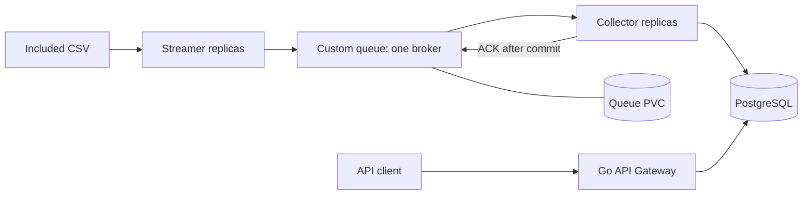

# GPU Telemetry Pipeline

A Go telemetry pipeline that replays GPU metrics from a CSV, delivers them through a custom durable message queue, stores them in PostgreSQL, and exposes a read-only REST API. Streamers and collectors can be scaled independently using Helm.

No physical GPU, NVIDIA driver, or DCGM installation is needed: the included dummy CSV supplies the measurements. This is an interview exercise with tested local deployment and explicit availability limits, not a production high-availability service.

## Assignment submission

This repository is the single entry point for the implementation, deployment instructions, demonstration and test evidence.

| Item | Location |
| --- | --- |
| Demonstration video | [Watch or download the demo](https://github.com/Dhiraj1729/gputelemetry/releases/tag/submission-v1) |
| Graphical installation | [Local deployment UI](#local-deployment-ui) |
| Manual installation | [Fresh clone to running pods](#from-a-fresh-clone-to-running-pods) |
| Test plan | [docs/TEST_PLAN.md](docs/TEST_PLAN.md) |
| Test results | [docs/DAY6_VERIFICATION.md](docs/DAY6_VERIFICATION.md) |
| Raw test evidence | [docs/test-artifacts](docs/test-artifacts) |
| API contract | [api/openapi.yaml](api/openapi.yaml) |

The demonstration video is distributed as a release asset so that normal clones remain small. The raw evidence is also checked into `docs/test-artifacts` as individually viewable text and JSON files.

## Architecture



- **Streamer:** periodically replays each CSV row; uses current UTC processing time for `processed_at` and preserves the historical source timestamp. Publish retries reuse the same event identity. Multiple replicas independently replay the dataset.
- **Queue:** a custom HTTP broker backed by bbolt, with bounded admission, publisher deduplication, leases, ACK/NACK, quarantine, and durable restart recovery. It uses competing consumers, not broadcast delivery.
- **Collector:** validates and persists events in PostgreSQL before acknowledging them. Unique `event_id` inserts make repeat persistence idempotent.
- **API Gateway:** a separate Go HTTP service querying PostgreSQL directly. Typed Huma operations generate OpenAPI. It does not consume queue messages. The API itself does not require a custom UI; `/docs` provides an interactive API reference. An optional local deployment console is included for setup and exploration.
- **Migration job:** applies embedded schema migrations before application rollout.

Delivery is **at least once**. Durability depends on retaining the underlying storage. The queue and PostgreSQL each run as one StatefulSet replica; neither is replicated. See [design decisions](docs/adr/0002-durable-single-broker.md) and [collector design](docs/DAY3_COLLECTOR.md).

## Required environment

The supported walkthrough below is the tested **Apple Silicon Mac + Colima + Minikube** path. The installer expects Homebrew at `/opt/homebrew`; it is not a generic Linux or Intel Mac installer.

| Tool | Used for |
| --- | --- |
| Xcode Command Line Tools | Git, make, and compiler support for local/race tests |
| Homebrew | Installing tools from `Brewfile` |
| Go | Build, tests and OpenAPI generation; module declares Go 1.27.1 |
| Git | Clone and version control |
| Colima | Linux VM and Docker daemon on macOS |
| Docker CLI + Buildx | Build Linux container images |
| Minikube + kubectl | Local Kubernetes cluster and workload inspection |
| Helm | Package and install the stack |
| jq | Verification scripts and API examples |
| ripgrep | Repository inspection; checked by the environment script |

Internet access is required for initial dependencies and image pulls. The bootstrap script configures **4 CPUs, 6 GiB RAM and a 40 GiB virtual disk for Colima**, with **3 CPUs and 4096 MiB for Minikube inside that VM**. These memory allocations are nested, not an extra 10 GiB; actual host use varies. Leave host memory and disk headroom and begin with one streamer and one collector. These are configured budgets, not measured minimum requirements.

Historical tested versions: Go 1.27.1, Colima 0.10.3, Docker CLI 29.8.0, Minikube 1.39.0, Kubernetes/kubectl 1.37.0, Helm 4.3.0. Homebrew installs available versions rather than locking that entire toolchain. Image references are pinned in the Dockerfile and chart.

## Existing installations

The default namespace for new installations is now `gpu-telemetry`. If you already have a deployment, select its namespace before running install, verify, or scale commands:

```sh
helm list --kube-context gpu-telemetry --all-namespaces
export NAMESPACE=YOUR_EXISTING_NAMESPACE
```

Replace the placeholder with the namespace shown for your release. This preserves the existing release, PVCs and data. Kubernetes namespaces are not renamed by changing a script default. Omitting this override on an older installation would target a separate stack. For manual `kubectl` examples below, replace `-n gpu-telemetry` with `-n "$NAMESPACE"` when using an existing namespace. See [naming migration notes](docs/NAMING_MIGRATION.md) for the previous namespace and command mappings.

## Local deployment UI

The included macOS UI automates local environment preparation and deployment, and provides a basic view of the API data. After downloading or cloning the repository, open the project folder and double-click **`Start Console.command`**. The launcher starts the bundled console, detects the repository path and opens the UI in your browser. Apple Command Line Tools and Homebrew must be installed separately; the UI checks whether they are available.

On the first launch, macOS may prevent the downloaded command or console binary from opening. If that happens:

1. Open **System Settings → Privacy & Security**.
2. Scroll to the security message for `Start Console.command` or `telemetry-console` and select **Open Anyway**.
3. Confirm **Open** in the next macOS prompt.
4. Double-click **`Start Console.command`** again if the console did not start automatically.

Depending on the macOS version, the command launcher and the bundled console may each require this approval once. Only approve the files after obtaining them from this repository.

From the UI you can install the project tools, start Colima and Minikube, build and load the images, choose up to 10 streamer and collector replicas, deploy with Helm, verify the running pipeline, connect to the API and browse telemetry by GPU. It also provides options to stop while retaining data, remove the deployment and its data, or remove the complete project environment. Use the execution log in the UI to follow each operation and investigate failures. The command-line workflow below remains available.

## From a fresh clone to running pods

Run commands in the repository root. A public HTTPS clone does not require SSH setup:

```sh
git clone https://github.com/Dhiraj1729/gputelemetry.git
cd gputelemetry
```

### 1. Install the host tools

On a new Mac, install Command Line Tools if absent:

```sh
xcode-select --install
```

Complete the macOS dialog. Install Homebrew following [brew.sh](https://brew.sh), then ensure it is on your shell PATH:

```sh
eval "$(/opt/homebrew/bin/brew shellenv)"
make tools
make doctor
```

`make tools` runs `scripts/install-tools.sh`, installs the ten `Brewfile` dependencies, and connects the Buildx plugin if needed. `make doctor` checks CLI availability and prints versions; it does not prove that the cluster is running. Docker Desktop is not needed for this path.

### 2. Build and check the Go code

```sh
make build
make test
make vet
make race
make coverage
make check-openapi
```

Executables are written to `bin/`. Coverage is written to `coverage/coverage.html` and `coverage/coverage.out`. These commands do not require Kubernetes; the explicitly tagged PostgreSQL integration tests below require Docker.

### 3. Start the local cluster

```sh
make cluster-up
kubectl --context gpu-telemetry get nodes
kubectl --context gpu-telemetry get storageclass
```

`scripts/cluster-up.sh` starts the named Colima and Minikube profiles, waits for the node, and saves versions in `work/environment-versions.txt`. Expect a Ready node and a default storage class. The Docker context is `colima-gpu-telemetry`; the Kubernetes context is `gpu-telemetry`.

### 4. Build all images and load them into Minikube

```sh
make docker-build
make minikube-load
```

One multi-stage [Dockerfile](deploy/docker/Dockerfile) has five final targets. The build script invokes each target and tags a separate image:

| Image built by default | Kubernetes workload |
| --- | --- |
| `gpu-telemetry/streamer:dev` | Streamer Deployment; CSV included at `/app/data/metrics.csv` |
| `gpu-telemetry/queue:dev` | Single-replica StatefulSet with queue PVC |
| `gpu-telemetry/collector:dev` | Collector Deployment |
| `gpu-telemetry/api:dev` | API Deployment |
| `gpu-telemetry/migrate:dev` | Short-lived migration Job |

PostgreSQL uses an upstream, digest-pinned `postgres:18.6` image; this project does not build it. Custom images use a shared Go builder and non-root distroless runtime. There is no shell in the custom images: use `kubectl logs` for routine diagnostics.

The default platform is `linux/arm64`. Building images in Colima does **not** place them in Minikube's containerd store: the load step is required. Nothing is pushed to an image registry.

### 5. Validate and deploy the Helm chart

```sh
make helm-check
make helm-template
make helm-package
make helm-install
```

The chart is [deploy/helm/gpu-telemetry](deploy/helm/gpu-telemetry). Rendered inspection output goes to `work/helm-rendered.yaml` and the packaged chart to `work/charts/`. The inspection manifest references a placeholder Secret and is not intended for `kubectl apply`.

**Use `make helm-install` for the initial installation.** It performs two phases:

1. Bootstrap PostgreSQL, its PVC and a generated development Secret, then wait for readiness.
2. Upgrade the same release, run the migration hook, and deploy the queue, streamer, collector and API.

A plain `helm install` with default values intentionally deploys only the bootstrap phase. Normal upgrades must keep `bootstrapOnly=false`. The installer handles this automatically.

Defaults are release `gpu-telemetry`, namespace `gpu-telemetry`, and context `gpu-telemetry`. Expect five Running application/database pods at baseline and one Completed migration pod. PVC requests are 1 GiB for the queue and 2 GiB for PostgreSQL.

### 6. Verify the deployment

```sh
make helm-verify
kubectl --context gpu-telemetry -n gpu-telemetry get pods,jobs,services,pvc
```

The verifier checks rollouts, migration completion, bound PVCs, API health/readiness, increasing database rows and ACK counts, non-empty API responses, and one queue replica. Its final line begins `PASS:`. It saves API responses and queue statistics in `work/verification-*.json`; counts vary with runtime.

The verifier starts its own port-forwards on **18080 and 18081**. Stop your manual forwards before running it, or use unused ports:

```sh
LOCAL_API_PORT=18090 LOCAL_QUEUE_PORT=18091 make helm-verify
```

### 7. Query the API

In terminal A, leave this running:

```sh
kubectl --context gpu-telemetry -n gpu-telemetry \
  port-forward service/gpu-telemetry-api 18080:8080
```

In terminal B:

```sh
curl -fsS http://127.0.0.1:18080/healthz
curl -fsS http://127.0.0.1:18080/readyz
curl -fsS http://127.0.0.1:18080/api/v1/gpus | jq
GPU_UUID=$(curl -fsS http://127.0.0.1:18080/api/v1/gpus | jq -er '.[0].uuid')
curl -fsS "http://127.0.0.1:18080/api/v1/gpus/$GPU_UUID/telemetry" | jq
TIME=$(curl -fsS "http://127.0.0.1:18080/api/v1/gpus/$GPU_UUID/telemetry" | jq -er '.[0].processed_at')
curl -fsSG "http://127.0.0.1:18080/api/v1/gpus/$GPU_UUID/telemetry" \
  --data-urlencode "start_time=$TIME" --data-urlencode "end_time=$TIME" | jq
```

Open **http://127.0.0.1:18080/docs** for the interactive reference. Live specifications are `/openapi.json` and `/openapi.yaml`; the generated offline artifact is [api/openapi.yaml](api/openapi.yaml). Run `make openapi` to regenerate it and `make check-openapi` to check freshness. Stop terminal A's forward with Ctrl-C afterward.

| Request | Behavior |
| --- | --- |
| `GET /api/v1/gpus` | GPUs with stored telemetry, ordered by UUID; empty database returns `[]` |
| `GET /api/v1/gpus/{id}/telemetry` | GPU UUID identity, ordered by `processed_at ASC, event_id ASC` |
| Optional `start_time`, `end_time` | Inclusive RFC3339 bounds on processing time |
| Unknown GPU | 404 |
| Known GPU, filtered-empty results | 200 with `[]` |
| Malformed or reversed bounds | 400 |
| Database/query or response-resource failure | 503 |

There is no pagination or hidden row limit. Responses are prepared row by row in a bounded temporary file before sending a complete JSON array. The default response budget is 64 MiB; exceeding it fails instead of silently truncating data. Narrow time windows for large histories.

## Bring-up scripts

| Script | Make entry point | Responsibility |
| --- | --- | --- |
| `scripts/install-tools.sh` | `make tools` | Install Homebrew dependencies and connect Buildx |
| `scripts/doctor.sh` | `make doctor` | Check installed tools and print versions |
| `scripts/cluster-up.sh` | `make cluster-up` | Start the named Colima VM and Minikube cluster |
| `scripts/images.sh` | `make docker-build`, `make minikube-load` | Build five targets or load them into Minikube |
| `scripts/helm-install.sh` | `make helm-install` | Bootstrap PostgreSQL, migrate and install/upgrade applications |
| `scripts/helm-verify.sh` | `make helm-verify` | Verify live ingestion, persistence and API access |
| `scripts/helm-scale.sh` | `make helm-scale` | Exercise two producer/consumer replicas and restore on success |
| `scripts/postgres-up.sh` | `make postgres-up` | Optional standalone Docker database for native Go development; not needed for Helm installation |

`make cluster-down` invokes Minikube and Colima directly; there is no separate shutdown script.

## Configuration and other environments

Chart settings and resource budgets are in [values.yaml](deploy/helm/gpu-telemetry/values.yaml). Supply overrides with `VALUES_FILE=/absolute/path/local-values.yaml make helm-install`. Preserve the same naming/context variables through build, load, install and verification.

| Variable | Default | Purpose |
| --- | --- | --- |
| `IMAGE_REPOSITORY` / `IMAGE_TAG` | `gpu-telemetry` / `dev` | Custom image prefix and version |
| `PLATFORM` | `linux/arm64` | Single-platform build; also accepts `linux/amd64` |
| `DOCKER_CONTEXT` | `colima-gpu-telemetry` | Image build/load source daemon |
| `MINIKUBE_PROFILE` | `gpu-telemetry` | Image load destination |
| `KUBE_CONTEXT` | `gpu-telemetry` | Installation and verification cluster |
| `RELEASE` / `NAMESPACE` | `gpu-telemetry` / `gpu-telemetry` | Helm release and namespace |
| `VALUES_FILE` | unset | Installer values overrides |
| `LOCAL_API_PORT` / `LOCAL_QUEUE_PORT` | `18080` / `18081` | Verifier port-forwards |

`make cluster-up` and `make cluster-down` use the fixed local profile names. Other clusters must be provisioned separately. They need working Kubernetes access, suitable persistent storage, Helm, and access to all image references. Override storage classes and use available images (registry publishing is a separate step not automated here). Match image platform to node architecture. AMD64 runtime and remote-cluster deployment have not been validated by the collected evidence.

For local Helm deployment, no manual database URL is needed: the chart injects credentials into the collector, API and migration job. For existing credentials, see the Secret contract in [packaging guide](docs/DAY5_PACKAGING.md). For native Go processes, see [collector configuration](docs/DAY3_COLLECTOR.md) and [API configuration](docs/DAY4_API.md), including `DATABASE_URL`. Use each executable's `--help` for flags.

## Updates, scaling and shutdown

Use a new image tag when code changes; replacing `dev` alone does not trigger a pod rollout:

```sh
make docker-build IMAGE_TAG=local-v2
make minikube-load IMAGE_TAG=local-v2
make helm-install IMAGE_TAG=local-v2
make helm-verify
```

`make helm-scale` exercises two streamers and two collectors and restores the initial counts after successful verification. If it fails, restoration is not automatic; inspect the state and restore the intended replica counts through Helm. Three of each were tested manually; the 10/10 exercise is deferred for laptop resource constraints. Keep queue replicas at one.

For routine shutdown and restart:

```sh
make cluster-down
# Later:
make cluster-up
make helm-verify
```

Stopping preserves local storage. Do not delete the namespace, PVCs or Minikube profile when you intend to retain data. Helm uninstall retains PVCs and the generated Secret; detailed lifecycle instructions are in the [packaging guide](docs/DAY5_PACKAGING.md).

## Troubleshooting

| Symptom | Check or action |
| --- | --- |
| Docker daemon unavailable | Run `make cluster-up`; check `docker --context colima-gpu-telemetry info` |
| `ImagePullBackOff` | Run `make minikube-load`; verify image tags and architecture match the chart |
| Only PostgreSQL exists | Complete both install phases with `make helm-install` |
| Migration fails | Read `kubectl --context gpu-telemetry -n gpu-telemetry logs job/gpu-telemetry-migrate`; preserve data while investigating |
| Verifier says `kill: ... No such process` | Inspect `work/verification-*-port-forward.log`; stop conflicting manual forwards or choose unused verifier ports |
| Brief publish retries during startup/restart | Check queue readiness and subsequent ACK/database progress; persistent retries require investigation |
| Publication stalls after a longer run | Queue deduplication capacity includes unexpired completed IDs (default 10,000 for one hour). Backpressure can occur even with ready=0. Inspect statistics and plan capacity/retention settings before longer or higher-rate tests |
| Pods Pending | Inspect pod events, resource requests and PVC binding; reduce workload scale if the laptop lacks headroom |

## Tests, evidence and limitations

| Command | Coverage |
| --- | --- |
| `make test`, `make race`, `make vet`, `make coverage` | Unit checks, race detector, static analysis, coverage report |
| `make integration` | Real-process queue/streamer tests; no Kubernetes needed |
| `make test-collector-integration`, `make test-api-integration` | Isolated real PostgreSQL tests; running Docker context required |
| `make helm-check` | Chart lint and packaging regression tests |
| `make openapi`, `make check-openapi` | Generate/check the typed OpenAPI contract without a database |
| `make helm-verify` | Live cluster ingestion and API verification |

[Acceptance test results](docs/DAY6_VERIFICATION.md) record deployment, API checks, 3/3 and brief 10/10 scaling, backlog drainage, restarts and final restoration to 1/1. Recorded unit coverage is 69.2%; PostgreSQL integration coverage is not merged into that figure. The documented [test plan](docs/TEST_PLAN.md) and [raw artifacts](docs/test-artifacts) are included in this repository. The 10/10 exercise was a short local capability test, not a sustained throughput benchmark.

No broker replication, automatic scaling/HPA, authentication, UI, lease renewal or automatic telemetry retention is implemented. Services use internal ClusterIP access; the walkthrough exposes the API locally through port-forwarding.

## AI assistance and project history

AI assisted with architecture, scaffolding, implementation, tests, packaging and documentation. The author supplied requirements, ran the Mac/Kubernetes acceptance tests and reviewed the results. Contributions, corrections and limitations are recorded in [AI usage](docs/AI_USAGE.md). Exact reference prompts remain private and are not included in this public repository; see [submission audit](docs/SUBMISSION_AUDIT.md) for that outstanding submission item.

The prior day-by-day README and repository map are in [workStructure](docs/workStructure.md). See the [submission audit](docs/SUBMISSION_AUDIT.md) for documentation history and remaining acceptance considerations.
