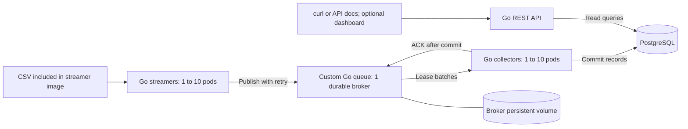

# GPU telemetry pipeline: requirements, design, and execution plan

Prepared 11 September 2026. Implementation starts Saturday 12 September. This is a proposed design and schedule, not a claim that the applications are implemented.

## Recommendation

Build four Go services in one Go module: streamer, custom queue broker, collector, and telemetry API. Deploy them with one Helm chart, plus PostgreSQL for shared telemetry storage. Use a durable competing-consumer queue with at-least-once delivery, leased messages, explicit acknowledgements, bounded resource use, and idempotent database inserts. Start with one broker and document its availability boundary honestly. Spend effort on failure tests, clear contracts, and reproducible deployment before a custom dashboard.

## Requirements taken from the PDF

The supplied PDF has three pages. Page 1 requires a custom message queue; using an existing MQ such as Kafka, RabbitMQ, or ZeroMQ is prohibited. It allows the queue to be a library or service. A CSV row is one independent datapoint; looping is allowed; use processing time as the telemetry timestamp. Streamers and collectors must scale dynamically, with exercise scale capped at 10 instances for each component. Go, Docker, Kubernetes, Helm, and autogenerated OpenAPI are required.

Page 2 requires source, Dockerfiles, Helm charts, unit tests, a comprehensive README, API documentation, and detailed AI-use documentation. System tests are a bonus.

Pages 2-3 specify GPU listing and time-ordered per-GPU telemetry queries, with inclusive optional start_time and end_time. Page 3 additionally calls for Makefile commands for coverage and OpenAPI generation, and detailed prompt records including failures requiring manual intervention.

A dashboard, real GPUs, DCGM installation, cloud hosting, automatic HPA scaling, distributed broker consensus, authentication, and a specific storage database are not explicitly mandated. Those should not displace required work. Helm installation on Minikube demonstrates Kubernetes deployment; do not label that a highly available production installation.

## Input inspection

The CSV is 1,107,455 bytes (1.056 MiB), with 2,470 data rows and 12 columns: timestamp, metric_name, gpu_id, device, uuid, modelName, Hostname, container, pod, namespace, value, labels_raw.

There are 247 distinct UUIDs, 31 hosts, and 10 metric types, with exactly 247 rows of each type. Thirty hosts have eight GPUs represented; one has seven. All sample GPUs use the H100 model string. gpu_id has only eight distinct values and is local to a host. Use uuid as the public GPU identifier.

Metrics are GPU utilization, memory-copy utilization, power usage, temperature, framebuffer used/free, decoder/encoder utilization, SM clock, and memory clock. Preserve metric names. Verify units against DCGM documentation before presenting any unit conversion in an optional UI.

Original timestamps are between 2025-07-18T20:42:34Z and 20:42:37Z. They are source metadata, not the simulated current telemetry time. container, pod, and namespace are empty in every row; these fields must be optional. Numeric values are finite in the sample, but still validate future inputs. No exact duplicate rows were found.

Use encoding/csv, never split lines by commas: labels_raw contains commas and escaped quotes. Keep labels_raw intact initially. Do not combine ten metric rows into one event merely because they belong to one GPU.

The CSV exceeds Kubernetes' 1 MiB ConfigMap limit. Copy it into the streamer image, with a configurable path. Avoid hostPath mounts tied to the developer laptop. A PVC/object-store source can be a future option.

## Mac environment

Audit: Apple Silicon M5 MacBook Air, 16 GB RAM, macOS 26.6, approximately 377 GiB available disk at inspection. VS Code is present. Go, Homebrew, Docker, Colima, Minikube, kubectl, and Helm were not found in standard locations or PATH. /usr/bin/git is present, but Apple Command Line Tools are not configured.

| Tool | Purpose |
| --- | --- |
| Apple Command Line Tools | Git, make, compiler/linker and macOS SDK prerequisites |
| Homebrew | Repeatable installation of developer tools via Brewfile |
| Go | Native edit/build/test/race/coverage workflow |
| Colima | Linux VM and Docker daemon for Linux containers on macOS |
| Docker CLI + Buildx | Build/tag/run application images; later multi-architecture builds |
| Minikube | Local Kubernetes cluster using Colima's Docker daemon |
| kubectl | Inspect workloads, logs, services, PVCs, and scale replicas |
| Helm | Install/upgrade/configure the complete stack |
| Git | Version history and eventual interview repository |
| jq and ripgrep | Inspect API JSON and search code/logs |

Use native arm64 tools and linux/arm64 local images. Build linux/amd64 images for an evaluator's x86 cluster when needed; document the tested platforms. Do not install NVIDIA drivers or CUDA for this CSV simulation. PostgreSQL runs in a container; no native Mac database installation is required.

Initial resource budget: Colima 4 CPUs, 6 GiB RAM, 40 GiB sparse disk; Minikube 3 CPUs and 4096 MiB inside that VM. This is a nested allocation, not 10 GiB of separate RAM reservations. Start with one replica per custom service. Ten streamers and ten collectors should be tested with small requests and controlled input rates; increase resource allocation only after measuring pressure. Keep Colima's own Kubernetes disabled to avoid a second cluster.

Bootstrap commands are in scripts/install-tools.sh and scripts/cluster-up.sh. A macOS administrator may need to finish Apple CLT and the initial Homebrew installation interactively. The scripts do not collect credentials. Named profiles isolate project state. Record exact successful versions in work/environment-versions.txt, then pin the Go toolchain, module dependencies, base images, database image, and tested Kubernetes version for submission.

Today is complete only when: CLT is configured; tool versions work; Docker server responds; a Go program builds and tests; a Linux image builds/runs; Minikube node is Ready; storage class is present; a small Helm smoke release installs successfully and is removed. Installed executables alone do not satisfy this gate.

## Architecture and responsibilities

Streamer and collector are ordinary Go applications when developing locally. Kubernetes runs their compiled binaries in containers, typically one application container per pod managed by a Deployment. Adding replicas runs more copies. A container alone does not provide correct scaling: retry semantics, work assignment, shared storage, and graceful shutdown are essential.

The API Gateway in this assignment can be a Go HTTP service that queries PostgreSQL. Deploy it as a Deployment with a ClusterIP Service. OpenAPI documents its API and can validate typed requests; an OpenAPI file does not start a server or expose a Kubernetes port. Start with kubectl port-forward for access from the Mac. An ingress controller or commercial API gateway is unnecessary for the required local demo.

The complete required workflow is CSV -> streamer -> queue -> collector -> storage -> REST query. A browser UI is optional. Autogenerated interactive API docs provide a useful browser demo at low implementation cost. A later dashboard would call the API; it should never connect directly to the queue or database.

## Streamer design

Use encoding/csv to iterate records with a configurable rate and cancellable wait. At EOF, reopen/rewind, read the header again, increment replay count, and continue. Reject missing required headers with a clear startup error. Keep producer concurrency and pending batches bounded.

For each row, create an envelope containing schema_version, event_id, producer_instance_id, replay_index, row_index, processed_at, and raw CSV fields. Set processed_at once when the streamer handles the row for its first publish; preserve the CSV timestamp as source_timestamp. Retries keep the same event_id and processed_at. A new pass or producer generates new events. Document this timestamp interpretation because the PDF does not identify a precise component boundary for processing time. The collector additionally records ingested_at on first successful insert.

Default independent replay mode: every replica simulates another producer replaying the input. Scaling producers increases load. This is valid simulation, but intentionally produces multiple new measurements from the same source rows. Never deduplicate by GPU plus metric plus source timestamp; that would erase all later replay rounds.

If the evaluator instead expects exactly one global traversal partitioned between replicas, add explicit source ownership with leases/checkpoints. Do not simply compute row_index modulo replica_count: changing the replica count without a coordinated handoff can skip or duplicate work. Independent replay is the simpler documented baseline.

Start at 10 events/second per streamer, with a configurable max batch size of 50 and a flush deadline of 100 ms; these are starting parameters, not benchmark claims. Rate-limit events, not batches. Back off with jitter on timeouts, 429, and transient 5xx. Apply a finite request timeout and bounded pending memory. Stop generating when the broker cannot accept messages.

On SIGTERM, stop reading and flush pending messages within the shutdown deadline. Accepted broker messages are covered by broker durability. Unaccepted events in producer memory can be lost in an abrupt producer crash; claim no durable guarantee before acceptance unless a producer outbox is added.

## Queue decision

| Design | Benefit | Cost / verdict |
| --- | --- | --- |
| In-process channel only | Simple and fast | Cannot connect separate pods; volatile. Useful for an internal prototype only |
| Network broker with bounded in-memory queue | Small first vertical slice | Accepted data disappears on broker restart |
| Custom broker with embedded transactional persistence | Durable acceptance and implementable lease/ACK semantics | Recommended submission scope; one active writer/broker |
| Custom append-only WAL and segment compaction | Maximum storage-engine control | Torn records, checksums, replay, sync policy and compaction increase schedule risk |
| Replicated broker with consensus | Can tolerate a broker-node failure | Major distributed-systems scope; document future design unless time permits |

Recommended transport: HTTP/JSON with persistent connections, batching, and long polling. Ten producers and ten consumers do not establish a throughput requirement; benchmark before switching to gRPC. JSON improves curl-based debugging and keeps initial dependencies small. Do not equate number of clients with achieved throughput.

Use bbolt as an embedded key/value persistence engine, not as a message queue. Our Go code still owns admission, ready/in-flight state, leases, retries, acknowledgement, deduplication, and consumer scheduling. The PDF bans existing MQs; an embedded storage engine is a proposed interpretation, to be documented. If all queue persistence must also be handwritten, replace the storage adapter with a WAL implementation and budget extra days.

Versioned internal API proposal:
- POST /internal/v1/messages: publish a bounded batch, atomic acceptance.
- POST /internal/v1/leases: long-poll for a batch, return message IDs plus unique delivery tokens and deadlines.
- POST /internal/v1/acks: acknowledge matching delivery tokens after database commit.
- POST /internal/v1/nacks: retry transient work or quarantine invalid work with a reason.
- GET /healthz, /readyz, /metrics.

Lifecycle: READY -> IN_FLIGHT -> ACKED. An expired lease returns to READY. Invalid payloads move to a bounded persistent dead-letter area. Stale delivery tokens cannot ACK or NACK a later attempt. Redelivery can overlap a slow old consumer, so the database must remain idempotent.

Persist accepted messages before reporting publish success. Keep sync enabled. Persist the lease transition before returning a delivery. ACK should durably record completion before reporting success. On restart, recover persisted records and expire/requeue outstanding leases safely. A ready-time index and a lease-deadline index avoid scanning the entire backlog. Do not hold a database transaction or queue mutex while waiting on a long poll or performing network I/O.

Publisher retries use event_id. Deduplicate active messages; retain bounded, expiring completion tombstones for a documented retry window. Database uniqueness remains the final protection against reinsert after that window. Bound ready plus in-flight plus dead-letter bytes, payload size, batch count, connections, waiters, and outstanding leases. Return explicit overload errors rather than silently discard accepted records. Keep Go channels as bounded notifications, not the authoritative durable backlog.

For embedded storage, ensure values are copied before a read transaction closes, keep write transactions short, and batch transactions. Define compaction/space-reclamation behavior; deleting logical entries may not shrink the file. Expose disk usage and enforce a capacity budget.

Availability boundary: one broker with a PVC can recover from a pod/process restart with the volume intact. It is a single point of service interruption; it is not replicated or tolerant of losing its disk. A StatefulSet provides identity and storage association, not distributed consensus. Never scale independent brokers behind one Service without queue ownership/routing: consumers may ACK a different broker and backlogs become isolated.

For future scale, partition by GPU UUID with explicit partition ownership and routing. For availability, replicate partitions with quorum commit and leader fencing. These are separate dimensions. Do not claim either is implemented until tested.

## Collector and persistence

Collectors share one logical consumer group and compete for work. Every event should go to one successful storage operation, not be broadcast to every collector. Pull only when worker capacity is available. Start with a small bounded worker pool and a DB pool of roughly two connections per collector; ten replicas then use about twenty collector connections rather than unbounded pools.

Validate schema version, mandatory UUID/metric/value fields, and finite numeric values. Preserve optional fields and labels. Commit bounded batches in one PostgreSQL transaction. Only after COMMIT succeeds send ACK. If commit fails, do not ACK. If commit succeeds but ACK fails, redelivery is safe because event_id has a unique constraint.

Transient database outages should back off and allow retry; do not exhaust a poison-message limit merely because the database is offline. Invalid messages are quarantined with an observable reason so valid telemetry continues. Handle one malformed row without rejecting valid rows forever. Keep database transaction time below the lease or implement lease renewal with fencing tokens. Graceful shutdown stops fetching and allows in-flight commits/ACKs within the pod deadline.

Proposed tables:
- gpus: uuid primary key, host, local_gpu_id, device, model_name, first_seen, last_seen.
- telemetry: event_id primary key, gpu_uuid foreign key, metric_name, value double precision, processed_at timestamptz, source_timestamp timestamptz, ingested_at timestamptz, optional workload metadata, labels_raw.

Create an index on telemetry(gpu_uuid, processed_at, event_id). Update first_seen with LEAST and last_seen with GREATEST; late commits must not move the latest metadata backward. PostgreSQL timestamps have microsecond precision, so normalize event times accordingly before publishing or document stored precision. Use ORDER BY processed_at ASC, event_id ASC for stable ties. Use INSERT ... ON CONFLICT (event_id) DO NOTHING for repeated deliveries.

Use PostgreSQL because separate collectors and API pods need shared durable concurrent storage. Independent SQLite files in each collector would fragment data. A shared network SQLite file also complicates locking. A custom Go database is not required by the phrase 'Golang'; all application code remains Go while using a standard database image.

Continuous replay causes continuous disk growth. For illustration, 100 events/second produces 8.64 million rows/day. A 10-event/second default is 864,000 rows/day. Measure actual bytes/event and use finite-duration performance tests. Do not silently delete historical data by default when the requirement says all entries; make any retention policy explicit and configurable.

## API and OpenAPI

Implement the required GET /api/v1/gpus and GET /api/v1/gpus/{id}/telemetry, where id is the GPU UUID. Accept optional RFC3339 timestamps with offsets, normalize to UTC, and apply >= start_time and <= end_time. Validate malformed times and start_time > end_time. Return a consistent JSON error. Suggested semantics: 404 for unknown GPU, 200 with empty entries for known GPU with no matches, and deterministic GPU ordering.

Choose Huma with Go's HTTP stack for typed handlers and autogenerated OpenAPI. Register routes in a function shared by the runtime and an offline generator, with no database connection required to produce the spec. Add make openapi to generate api/openapi.yaml and expose /openapi.json and /docs from the same registered contracts. Test that generated output is current. OpenAPI describes responses, errors, parameters, and filtering semantics.

The wording 'all telemetry entries' matters. Do not add an undocumented default LIMIT 100. For the literal baseline, stream the complete ordered result with bounded application memory and cancellation. Offer opt-in cursor pagination for large histories, documenting that clients follow all pages. If making pagination the default, obtain requirement clarification and document the contract change. Avoid fetching unbounded results into a Go slice. Define query deadlines and how clients detect an interrupted streamed response.

Use context cancellation, parameterized SQL, HTTP timeouts, and small DB pools. The API reads stored telemetry and remains available while collectors temporarily lag. A read-only DB user is a useful hardening step. A custom UI is a stretch goal after acceptance tests pass.

## Docker and Helm

Build four images: gpu-streamer, gpu-queue, gpu-collector, gpu-api. Multi-stage Dockerfiles compile the relevant cmd binary and copy only required runtime assets. Use non-root runtime users, read-only root filesystems where feasible, explicit writable mounts for broker data, and immutable tags/digests for submission. Use one Dockerfile per app or clearly documented build targets; avoid four duplicated dependency-download sequences through build caching.

Use the upstream PostgreSQL image as a fifth workload. No custom database image is needed. The chart should support an external PostgreSQL instance later, but include a small local PostgreSQL StatefulSet for a self-contained interview install.

One Helm chart can include: streamer Deployment; collector Deployment; API Deployment and Service; broker StatefulSet and Service/PVC; PostgreSQL StatefulSet and Service/PVC; configuration and Secret references; a versioned migration Job; an install smoke test. Make application retry logic tolerate startup order. Run migrations in one Job, not concurrently from every collector. Document initial install versus upgrade migration sequencing and failures.

Values should expose replica counts, image repositories/tags/pull policy, CSV path and replay rate, queue capacity/lease/batch configuration, DB connection settings, resource requests/limits, probes, and persistence sizes. Constrain queue replicas to one until replication exists. Use startup/readiness/liveness probes with different purposes; a DB outage should not trigger endless liveness restarts of healthy processes.

Suggested initial memory requests/limits (starting budgets, to measure): streamer 32/128 MiB, collector 64/256 MiB, API 64/256 MiB, queue 128/512 MiB, PostgreSQL 256/768 MiB. Start CPU requests around 25m for streamer, 50m for collector/API, 100m queue, and 250m PostgreSQL. Ten-replica experiments may require tuning or reducing optional processes.

Use ClusterIP services and port-forward for the local demo. Build in Colima and explicitly load images with minikube -p gpu-telemetry image load --daemon IMAGE. Use unique local tags plus IfNotPresent. The Colima daemon image store and Minikube's containerd image store are distinct.

Dynamic scaling does not necessarily mean automatic scaling. Demonstrate live 1 -> 3 -> 10 -> 2 changes via Helm values or kubectl scale, without a full restart. Helm values should reflect the intended final replica count; a later Helm upgrade can revert an imperative scale. HPA is optional. Collector autoscaling should eventually use backlog age/depth via custom metrics; CPU is a weaker proxy for I/O-bound workers. Streamer replicas represent input load and should usually be intentionally controlled.

## Repository layout

Keep Problemstatement/ intact. Use one Go module at the root. cmd/streamer, cmd/queue, cmd/collector, and cmd/api own entrypoints and composition. internal/telemetry owns event types and validation. internal/queue owns semantics/persistence, internal/queueclient the transport client, internal/streamer replay, internal/collector processing, internal/storage/postgres queries, internal/api handlers, internal/config configuration, and internal/observability shared instrumentation.

Use migrations/ for SQL, api/ for generated OpenAPI, deploy/docker/ for Dockerfiles, deploy/helm/gpu-telemetry/ for the chart, tests/system/ for cross-service tests, tests/testdata/ for small synthetic fixtures, scripts/ for repeatable operations, and docs/adr plus docs/prompts for decisions and exact AI prompts. Unit tests live next to their Go packages. Do not introduce four Go modules or a generic framework unless there is a concrete need.

## Tests, measurements, and omissions to close

Required unit tests: CSV quoting and EOF looping; replay IDs and stable retry timestamps; invalid configuration; queue capacity; concurrent publish/lease/ACK; lease expiry; stale ACK rejection; retry deduplication; broker recovery; permanent invalid records; collector commit-before-ACK; duplicate insert; inclusive API filters and invalid bounds; deterministic tie ordering. Use temporary databases/files, httptest, and an injected clock where appropriate. Real PostgreSQL and broker crash tests are integration/system tests, and should be clearly labeled.

Expose make test, make race, make coverage with go test -coverprofile and go tool cover -func/-html, and make openapi. A sensible internal target is at least 80% on core queue/processing logic, but the PDF specifies no percentage. Coverage is evidence of exercised lines, not proof of correctness. Track which failure cases are tested.

The strongest demonstration is: stream a controlled finite set; kill a collector after commit but before ACK; verify redelivery causes no duplicate stored event; restart the broker with the PVC; verify accepted messages recover; pause collectors and verify bounded queue/backpressure; resume and drain; scale producers/consumers live; query boundary timestamps through the API.

Record accepted/persisted counts, queue ready and in-flight depth, oldest message age, redeliveries, quarantined count, publish/commit latency, process CPU/RSS, DB connections, and disk growth. Avoid GPU UUID/event_id labels in operational metrics because they create unnecessary cardinality. Use structured slog logs with event IDs for debugging instead.

Benchmark a stated workload with 1, 3, and 10 replicas, report actual throughput and p50/p95/p99 latency, duration, payload size, batch size, and machine resources. Separate correctness runs from throughput runs. Do not invent a performance guarantee from the sample's small size.

Explicitly document: processing timestamp interpretation, duplicate replay behavior, delivery guarantee boundary, single-broker/PVC failure boundary, ordering guarantee, queue full policy, message size limits, retention, poison-message handling, migration behavior, image architecture, secrets handling, restart/cleanup commands, and AI prompts plus corrections. These are the most likely omissions in a rushed submission.

## Day-wise delivery plan

Assumption: roughly 5-6 focused hours/day. No deadline was supplied. Reserve 40-50 implementation hours plus setup and contingency. If only two hours/day are available, spread the same milestones over roughly three to four weeks. The queue's persistence/concurrency work is the critical path.

| Day | Date | Focus | Exit evidence |
| --- | --- | --- | --- |
| 0 | Fri 11 Sep | Mac tools, directory scaffold, VM, Minikube, smoke checks | Go/Docker/Helm smoke checks and Ready node; versions recorded |
| 1 | Sat 12 Sep | Freeze contracts; Go module/config; CSV replay; first memory-backed queue slice | Correct CSV parsing, fresh replay IDs/times, one streamer publishes and one consumer receives |
| 2 | Sun 13 Sep | Durable broker, leases, ACK/NACK, recovery, bounds | Concurrent and failure unit tests pass; recovery works; no unbounded backlog in RAM |
| 3 | Mon 14 Sep | PostgreSQL migrations and collector | Commit-before-ACK and duplicate-delivery tests; data persists end to end |
| 4 | Tue 15 Sep | API, inclusive filtering, generated OpenAPI | Required endpoints verified; make openapi works without running DB |
| 5 | Wed 16 Sep | Four Docker images; complete Helm chart | Clean install of all five workloads; PVCs, probes and port-forward API work |
| 6 | Thu 17 Sep | Live scaling, failure injection, backlog and performance measurements | 1/3/10-replica evidence; broker/collector restart and DB outage tests |
| 7 | Fri 18 Sep | Refactor, CI, coverage, README, prompts, demo | Fresh checkout build/install workflow independently rerun; core scope ready |
| 8 | Sat 19 Sep | Contingency, interview rehearsal; optional small dashboard only if green | Submission freeze; known limits documented; short demo rehearsed |

Keep tests and the AI record current every day. Do not postpone all Helm work until day 5: establish deployment conventions early, then integrate the complete chart on that day. If behind, drop dashboard, HPA, ingress, and distributed broker replication first. Preserve the custom queue, durable delivery semantics, required API, Helm install, tests, and documentation.

## Official references consulted

- Homebrew prerequisites and Apple Silicon prefix: https://docs.brew.sh/Installation
- Go installation: https://go.dev/doc/install
- Colima installation and Buildx plugin: https://colima.run/docs/installation/
- Colima commands: https://colima.run/docs/commands/
- Colima with Minikube: https://colima.run/docs/faq/
- Minikube Docker driver: https://minikube.sigs.k8s.io/docs/drivers/docker/
- Minikube image loading: https://minikube.sigs.k8s.io/docs/handbook/pushing/
- ConfigMap size: https://kubernetes.io/docs/concepts/configuration/configmap/
- StatefulSet behavior: https://kubernetes.io/docs/concepts/workloads/controllers/statefulset/
- HPA behavior: https://kubernetes.io/docs/concepts/workloads/autoscaling/horizontal-pod-autoscale/
- bbolt storage library: https://pkg.go.dev/go.etcd.io/bbolt
- Huma OpenAPI generation: https://huma.rocks/features/openapi-generation/
- Huma offline CLI generation: https://huma.rocks/features/cli/
- PostgreSQL conflict handling: https://www.postgresql.org/docs/18/sql-insert.html

The supplied PDF and CSV are the project-specific evidence. External documentation supports tool behavior; architecture choices and resource budgets above are recommendations, not requirements copied from the PDF.

## Implementation status — 12 September 2026

Day 1 is complete and regression-tested. Day 2 is now implemented: a bbolt-backed single broker, persisted publisher deduplication, leased delivery, ACK/NACK, bounded capacity/cleanup, restart recovery, and a lease-aware diagnostic consumer. The original streamer/event/publish contract is preserved. Destructive receive is isolated in explicit memory mode.

Build, vet, unit tests, race detector, coverage and real-process crash/restart demos passed. Detailed evidence and commands are in docs/DAY2_VERIFICATION.md, the README and docs/DAY2_PROTOCOL.md. No application deployment or Git commit was performed.

Day 3 collector/PostgreSQL implementation and user-run integration verification are complete (docs/DAY3_VERIFICATION.md). See the Day 4 update below for API/OpenAPI status. Docker/Helm packaging and later scaling/performance work remain outstanding. The broker is durable only as far as its surviving local storage; replication/high availability, lease renewal, live compaction and quarantine operator tooling are not implemented.

## Day 4 implementation update

Day 3's remaining gate passed in the user's Mac Terminal on PostgreSQL 18.6, as recorded in docs/DAY3_VERIFICATION.md. Day 4 now implements the read-only Go/Huma API, PostgreSQL visitor queries, inclusive timestamp bounds, complete disk-buffered JSON arrays, health/readiness, configuration and generated OpenAPI with freshness checking. Build, vet, unit/race checks and Day 1/Day 2 process regressions passed. Real Day 4 PostgreSQL integration is pending the agent environment's unavailable Docker context; see docs/DAY4_VERIFICATION.md. Dockerfiles/Helm and later scaling/performance work remain outstanding.

## Day 5 packaging update — 13 September 2026

Day 4's real PostgreSQL gate passed in the user's Terminal, recorded in docs/DAY4_VERIFICATION.md. Day 5 adds five image targets and a single Helm chart with two-phase database bootstrap/full deployment, pre-upgrade migrations, retained PVCs/Secret and build/load/install/verify/scale scripts. No application semantics or schema changed. Static chart validation and Linux ARM64 compilation passed; Docker image builds, local installation and live scaling remain unverified because the agent environment cannot resolve the user's Docker/Kubernetes contexts. See docs/DAY5_VERIFICATION.md. Day 6 performance and broader failure testing remain outstanding.
